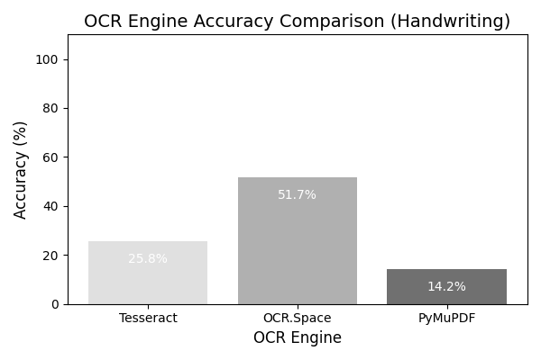
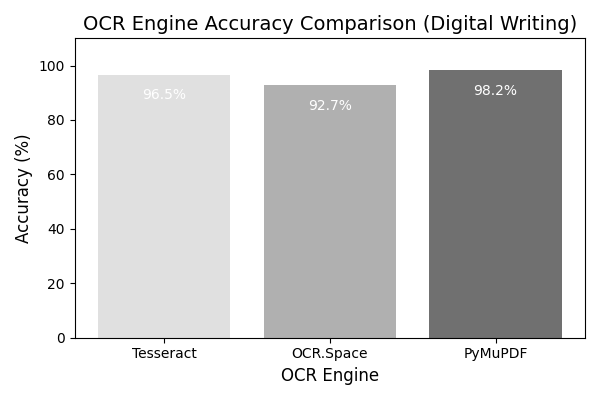

# 🧠 OCR 비교 프로젝트 (손글씨 vs 디지털 글씨)

이 프로젝트는 **Tesseract**, **OCR.Space API**, **PyMuPDF** 세 가지 OCR 엔진을 활용하여 **손글씨 텍스트**와 **디지털 글씨 텍스트**의 인식률을 비교한 실험 과제입니다.

---

# 📘 프로젝트 개요

이 실험의 목적은 다음과 같습니다:
- 서로 다른 OCR 엔진의 성능 차이를 비교하고 분석한다.  
- 손글씨와 디지털 텍스트의 인식률 차이를 정량적으로 측정한다.  
- 이미지 전처리 기법(이진화, 노이즈 제거, 대비 강화 등)이 OCR 결과에 미치는 영향을 확인한다.  
- OCR 결과를 시각적으로 비교하여 인식 정확도의 경향을 파악한다.  

---

## ⚙️ 개발 환경

- Python 3.10+
- 주요 라이브러리:  
  `opencv-python`, `pytesseract`, `Pillow`, `fitz (PyMuPDF)`, `requests`, `Levenshtein`, `matplotlib`
- 실행 환경: Ubuntu 22.04 (Virtual Environment 사용)

---

## 🧩 디렉토리 구조
```
1103_assignment/
├── data/ # OCR 테스트용 원본 데이터
│ ├── digitalwriting.jpg # 디지털 글씨 이미지
│ ├── digitalwriting.pdf # 디지털 글씨 PDF
│ ├── handwriting.jpeg # 손글씨 이미지
│ ├── handwriting.pdf # 손글씨 PDF
│ └── original.txt # OCR 결과 비교용 원문 텍스트
│
├── results/ # 손글씨 실험 결과 저장 폴더
│ ├── ocr_accuracy_handwriting.png # 인식률 그래프 (손글씨)
│ └── ocr_results_handwriting.txt # 각 엔진별 결과 요약 (손글씨)
│
├── results_digital/ # 디지털 글씨 실험 결과 저장 폴더
│ ├── ocr_accuracy_digital.png # 인식률 그래프 (디지털 글씨)
│ └── ocr_results_digital.txt # 각 엔진별 결과 요약 (디지털 글씨)
│
├── temp/ # 손글씨 이미지 전처리 임시 파일
│ ├── bw_image.jpg
│ ├── contrast_boost.jpg
│ ├── light_contrast.jpg
│ ├── no_noise.jpg
│ └── resized.jpg
│
├── temp_digital/ # 디지털 글씨 이미지 전처리 임시 파일
│ ├── bw_image.jpg
│ ├── contrast_boost.jpg
│ ├── light_contrast.jpg
│ ├── no_noise.jpg
│ └── resized.jpg
│
├── .gitignore
├── ocr_assignment.py
└── ocr_assignment_digital.py
```

---

## 🚀 실행 방법

### 1️⃣ 가상환경 활성화
- source ~/flask_app/venv/bin/activate

### 2️⃣ 코드 실행
- python ocr_assignment.py
- python ocr_assignment_digital.py

### 3️⃣ 결과 확인
➡️ 결과는 아래 경로에 자동 저장됩니다.
- /results
- /results_digital

---

## 📈 OCR 처리 과정 요약

### 1️⃣ 이미지 불러오기 및 전처리
- Grayscale 변환
- 대비 강화 (명암 대비 조절)
- Threshold를 이용한 이진화
- Morphological 연산을 통한 노이즈 제거

### 2️⃣ OCR 엔진별 텍스트 추출
- Tesseract: 로컬 OCR 엔진 (kor+eng 혼합 지원)
- OCR.Space API: 클라우드 기반 OCR (API Key 사용, 응답 시간 설정)
- PyMuPDF: PDF 내부 텍스트 및 이미지 OCR 처리

### 3️⃣ 결과 비교 및 정확도 계산
- Levenshtein Distance를 활용하여 원본 텍스트(original.txt)와 OCR 결과 문자열의 유사도 계산 (1 - distance / max_length) * 100 공식을 사용해 인식률(%) 산출

### 4️⃣ 시각화 및 저장
- matplotlib으로 엔진별 인식률을 막대그래프로 시각화
- 결과 텍스트 파일(ocr_results_*.txt) 및 그래프 이미지(ocr_accuracy_*.png) 저장

---

## 📊 인식률 결과
| 테스트 구분 | Tesseract | OCR.Space | PyMuPDF |
| ------ | --------- | --------- | ------- |
| 손글씨    | 25.8%     | 51.7%     | 14.2%   |
| 디지털 글씨 | 96.5%     | 92.7%     | 98.2%   |

---

## 📊 인식률 비교 그래프

### ✍️ 손글씨 결과


### 💻 디지털 글씨 결과


---

## 🧩 결과 요약
- 손글씨의 경우 OCR.Space API가 가장 높은 인식률(51.7%)을 기록했지만 전체적으로 글자 형태 불규칙성으로 인해 낮은 정확도를 보임.
- 반면 디지털 글씨는 모든 엔진이 90% 이상의 높은 인식률을 보였으며 PyMuPDF가 98%로 가장 정확한 결과를 나타냄.
- 손글씨에서는 전처리(이진화, 노이즈 제거, 대비 강화)의 효과가 제한적이었지만 디지털 글씨에서는 전처리 후 인식률 향상이 명확하게 나타남.

---

## 💬 결론 및 향후 개선 방향
- 손글씨 인식률은 전반적으로 낮게 나타났으며, 이는 글자 간 간격 불균일, 필기체의 다양성, 배경 노이즈 등의 영향으로 추정된다.
- 디지털 텍스트는 명확한 윤곽선 덕분에 거의 완벽하게 인식된다.
- 향후 개선을 위해 다음 방법을 고려할 수 있다:
  - CNN 기반 딥러닝 OCR 모델(CRNN, EAST, CRAFT 등) 적용
  - 손글씨 전용 데이터셋으로 fine-tuning


