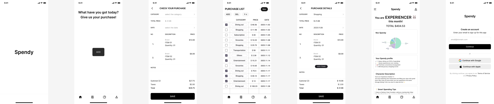

# 🧾 Spendy — 영수증 기반 소비 심리 분석 서비스

> **AI Cloud Bootcamp Project (2025)**  
> 영수증 OCR + VALS 심리 분석을 활용한 개인 재무 관리 서비스

---

## 🚀 Overview
**Spendy**는 영수증을 OCR 기술로 자동 인식하여 사용자의 소비 패턴을 분석하고, **VALS(Values and Lifestyles)** 모델을 기반으로 **소비 성향 및 심리 캐릭터**를 제공하는 서비스입니다.

📸 영수증 업로드 → 💬 자동 인식 → 📊 소비 통계 + 🐰 성향 분석

---

## 💡 핵심 가치
- **자동화된 입력:** 수기 가계부 작성 시간 90% 단축  
- **데이터 기반 자기 이해:** 무의식적 소비 습관 시각화  
- **심리적 몰입감:** 귀여운 캐릭터 + 스토리텔링  
- **맞춤형 피드백:** VALS 유형별 소비 조언 제공  
- **지속적 사용 유도:** 월말 리포트, 캐릭터 수집

---

## 🧠 VALS 4가지 소비 성향
| 캐릭터 | 타입 |
|---------|--------|
| 🦊 Trendsetter | 쇼핑 중심, 트렌드 리더형 |
| 🐻 Thinker | 계획적 소비, 장보기 중심 |
| 🐰 Experiencer | 외식·여가 중심의 경험 추구형 |
| 🐼 Believer | 절약·균형형, 합리적 소비 지향 |

📍 원래 VALS 모델은 8가지 유형(Innovators, Thinkers, Achievers, Experiencers, Believers, Strivers, Makers, Survivors)으로 구성되어 있으나, 본 프로젝트에서는 4가지로 간소화하여 적용합니다.

---

## ⚙️ Tech Stack
| 구분 | 기술 |
|------|------|
| **Frontend** | React, Tailwind CSS |
| **Backend** | Node.js (Express), Google Vision API |
| **Database** | SQLite |
| **Infra** | Kakao Cloud VM (Ubuntu + Nginx + SSL) |
| **Deploy** | Vercel (FE), PM2 (BE) |

---

## 🖼️ Figma 시안 미리보기
> 아래 이미지는 `figma_image` 폴더 안에 저장된 시안을 불러옵니다.

